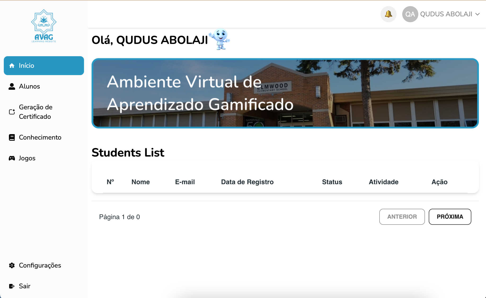

# AVAG – Ambiente Virtual de Aprendizado Gamificado  
**Gamified Virtual Learning Environment**

AVAG is a **responsive, gamified learning platform** designed for schools and educational institutions.  
It combines structured learning content, interactive games, performance tracking, and rewards to create an engaging and effective digital learning experience for students, teachers, and administrators.

The platform is fully functional on **desktop and mobile devices** and includes a powerful **Admin Panel** and **Teacher Module** for content and institution management.

#### Visit the website: [Avagapp.com](https://avagapp-phi.vercel.app)
---
## Demo Preview




## 🔗 Reference Platforms
AVAG is inspired by leading educational platforms such as:
- https://twygo.com  
- https://www.ludospro.com  

---

## 🎯 Project Objectives
- Create a **gamified virtual learning environment** that improves engagement and motivation
- Allow **teachers to upload learning content and quizzes**
- Enable **administrators to manage institutions and monitor performance**
- Provide **students with interactive games, rankings, badges, and certificates**
- Ensure the platform is **functional, enjoyable, and scalable**

---

## 👥 User Roles & Permissions

### 🧑‍🎓 Student
- Access courses and learning activities
- Play educational games
- Receive sounds for:
  - Correct answers
  - Wrong answers
  - Task completion
- Earn points, badges, and rankings
- Progress through courses based on performance rules
- Generate and download **course completion certificates**
- Share achievements on social media

---

### 🧑‍🏫 Teacher
- Upload and manage course content
- Create quizzes and games
- Define **rules for course progression** (minimum correct answers required)
- Point out correct answers in quizzes via a dedicated UI
- Manage **Knowledge Trails**
- Track student performance and engagement

> ⚠️ Teachers **do NOT** have access to Institution Management

---

### 🧑‍💼 Administrator
- Full system access
- Monitor platform-wide performance
- Manage institutions
- Manage users (teachers and students)
- Manage **Knowledge Trails**
- Oversee analytics, rankings, and engagement data

---

## 🧩 Core Features

### 🎮 Gamified Learning System
- Interactive educational games
- Rankings & leaderboards
- Badges and achievements
- Knowledge progression system
- Performance-based unlocking of content

---

### 📝 Quizzes & Assessments
- Multiple question types (based on Quizizz standards):  
  https://support.quizizz.com/hc/en-us/articles/4409852287513-Question-Types-Explained
- Teacher interface to **select and highlight correct answers**
- Rule-based completion:
  - Students must achieve a minimum score to progress

---

### 🧠 Knowledge Trail Management
- Structured learning paths
- Available to:
  - Teachers
  - Administrators
- Not accessible to students for editing

---

### 🏫 Institution Management
- **Admin-only feature**
- Manage schools, courses, and institutional data
- Assign teachers and track institutional performance

---

### 🏆 Certificates
- Automatic certificate generation
- Certificate download available **after course completion**
- Student-only visibility

---

### 🔊 Audio Feedback
- Sound effects for:
  - Correct answers
  - Incorrect answers
  - Task completion
- Enhances engagement and learning feedback

---

## 📧 Email Marketing Integration (UI Design)
The platform includes a **dedicated UI interface** for email marketing integration that allows:
- Automated course reminders
- Learning progress updates
- New course recommendations
- Engagement notifications

---

## 🌐 Social Media Sharing (UI/UX)
- Built-in social sharing UI
- Students can share:
  - Achievements
  - Badges
  - Certificates
- Helps increase platform visibility and engagement

---

## 📱 Responsive Design
- Fully responsive layout
- Optimized for:
  - Mobile phones
  - Tablets
  - Desktop browsers

---

## 🛠️ Tech Stack (Suggested)
- **Frontend:** React / Next.js
- **Backend:** Node.js + Express
- **Database:** MySQL / PostgreSQL
- **Authentication:** JWT / OAuth
- **UI/UX:** Figma-based design system
- **Hosting:** Vercel / AWS / DigitalOcean

---

## 📂 Project Structure (Example)
```bash
AVAG-kid-learning-app/
├── frontend/
├── backend/
├── admin-panel/
├── teacher-module/
├── student-dashboard/
├── database/
├── public/
└── README.md

```
## Project Name

Ambiente Virtual de Aprendizado Gamificado (AVAG)
Gamified Virtual Learning Environment

## 📄 License

This project is proprietary and developed for educational use.
All rights reserved.
